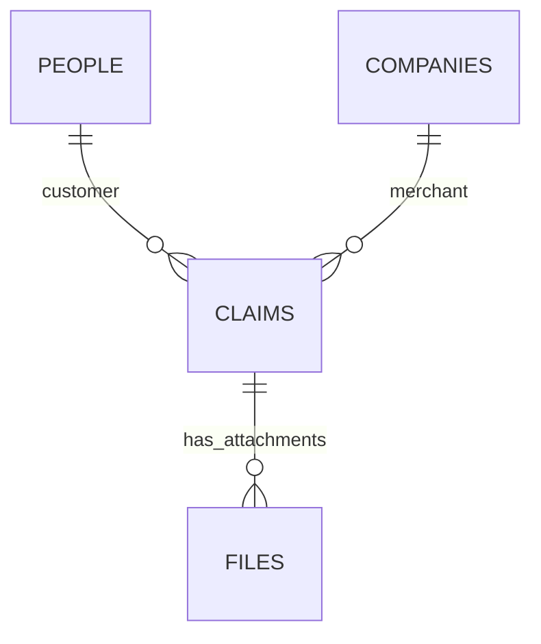

# Attio Schema & Form Integration Design

To capture customer complaints, issue details, and evidence photos natively in Attio, we must establish a clear data model using both **Standard Objects** and a custom **Claim Object**, connected via relationship attributes. 

This layout creates a comprehensive, 360-degree customer history (the "customer picture of the issue") directly inside the Attio CRM.

---

## 1. Object Schema & Relationships

To represent the relationships between customers, merchants, and individual claims, we map them as follows:



### A. Custom Object: `claims`
Each submission represents a unique claim record. We define the following attributes:

| Attribute API Slug | Type | Description |
|---|---|---|
| `correlation_id` | Text (Unique) | The unique ID of the claim, matches SQLite primary key. Generated in n8n **before** claim creation so retries are idempotent. |
| `order_number` | Text | The order number from the merchant's OMS. |
| `courier` | Select | The carrier handling the parcel. Options: `Evri`, `DPD`, `Royal Mail`, `Yodel`, `Other`. |
| `tracking_number` | Text | The primary courier barcode/tracking number (`T0...` or `H0...`). |
| `additional_tracking` | Text (Multiline) | Any further tracking numbers for multi-parcel claims (one per line). |
| `claim_type` | Select | Options: `Lost`, `Damage`. |
| `parcel_count` | Number | Number of parcels covered by this claim. |
| `delivery_postcode` | Text | Delivery destination postcode (used for courier verification). |
| `phone_number` | Text | Customer contact phone number for this claim. |
| `customer_comment` | Text (Multiline) | The customer's description of the issue / reason for the claim. |
| `status` | Status (Pipeline) | Options: `New` -> `Pending` -> `Raised` -> `Accepted` \| `Rejected` \| `DOR` \| `OnHold`. |
| `parcel_value` | Number | Customer-stated cost value of the claim (capped at the merchant `ceiling`). |
| `customer` | Relationship | Links to a record in the standard `people` object (1:M). |
| `merchant` | Relationship | Links to a record in the standard `companies` object (1:M). **Derived server-side in n8n** — not asked of the customer. |

> **Note on `phone_number`:** the customer's phone is also written to `people.phone_numbers` during the person upsert (Step 1). It is duplicated on the claim so operators see the contact number that was supplied *at the time of this specific claim*.

### B. Standard Object: `people` (The Customer)
Represents the consumer who purchased the item. Attio automatically enriches this record:
*   `name` (Person's name)
*   `email_addresses` (Primary contact email)
*   `claims` (Inverse relationship pointing to all `claims` linked to this person)

### C. Standard Object: `companies` (The Merchant)
Represents the client brand or e-commerce shop submitting the claim:
*   `name` (Brand name, e.g. "Shopify Merchant X")
*   `domains` (Company domain)
*   `ceiling` (Number: £20/£25 limit depending on courier service SLA)

---

## 2. Ingesting Claims & Images (The n8n Form Flow)

Because Attio does not host a public web form natively — and because the Attio API token must **never** be exposed in browser code — the React/HTML form never calls Attio directly. Instead it POSTs to an **n8n webhook**, which holds the token as a credential and orchestrates the Attio REST API v2 calls server-side.

The customer's browser only ever talks to n8n; n8n is the only thing that talks to Attio.

```
[ Public Form (React/HTML) ]
        │
        │ POST  multipart/form-data  (text fields + photo binary)
        ▼
[ n8n Webhook node ]  ── "Binary Data" enabled to capture the photo
        │
        ├──► 0. Generate correlation_id (UUID)        ← before any Attio call → idempotent retries
        ├──► 1. Upsert Person:  PUT  /v2/objects/people/records   (match by email_addresses)
        ├──► 2. Resolve Merchant (derived server-side, NOT from the form)
        ├──► 3. Create Claim:   POST /v2/objects/claims/records   (links Person + Merchant)
        └──► 4. Upload Photo:   POST /v2/files                    (multipart, linked to Claim ID)
        ▼
[ Respond to Webhook ]  → 200 + claim reference back to the form
```

### n8n node map (build-ready)

| # | n8n node | Purpose |
|---|---|---|
| 1 | **Webhook** (Trigger) | Receives the form POST. Enable **Binary Data** so the photo lands in n8n's binary buffer for the upload node. |
| 2 | **Set / Edit Fields** | Normalize + validate form fields; map form names → Attio attribute slugs. |
| 3 | **Crypto** (or Code) | Generate `correlation_id` (UUID) so a double-submit doesn't create a duplicate claim. |
| 4 | **HTTP Request** — Upsert Person | `PUT /v2/objects/people/records`, matching on `email_addresses`. Returns `person_record_id`. |
| 5 | **Set / Code** — Resolve Merchant | Derive the merchant `company_record_id` server-side (see *Merchant derivation* below). |
| 6 | **HTTP Request** — Create Claim | `POST /v2/objects/claims/records`, linking customer + merchant. Returns `claim_record_id`. |
| 7 | **HTTP Request** — Upload Photo | `POST /v2/files`, `multipart/form-data`, references `claim_record_id` from node 6. |
| 8 | **Respond to Webhook** | Return `200` + claim reference to the form. |

> **Auth:** Add the Attio token once as an n8n **Header Auth credential** (`Authorization: Bearer <token>`) and attach it to every HTTP Request node. The token lives only in n8n — never in the form bundle.

### Merchant derivation (server-side)

The customer is never asked which merchant they bought from. n8n resolves it from submission context — e.g. a per-merchant webhook path/ID, a hidden form token, or the merchant's domain — then looks up (or upserts) the `companies` record and links it to the claim. This keeps the customer experience clean and prevents mis-attribution.

### Step 1: Matching or Creating the Customer (Person)
Identify if the complaining customer already exists in Attio. If not, create them:
*   **Endpoint:** `PUT /v2/objects/people/records`
*   **Matching Attribute:** `email_addresses`
*   **Payload:**
    ```json
    {
      "data": {
        "values": {
          "name": "Sarah Jenkins",
          "email_addresses": ["sarah@example.com"],
          "phone_numbers": ["+447700900123"]
        }
      }
    }
    ```
*   *Returns: `person_record_id` (e.g. `p_12345`).*

### Step 2: Creating the Claim Record
Create the custom `claim` record and link it directly to the customer (Person ID) and merchant (Company ID, derived server-side):
*   **Endpoint:** `POST /v2/objects/claims/records`
*   **Payload:**
    ```json
    {
      "data": {
        "values": {
          "correlation_id": "clm_789abc",
          "order_number": "ORD-99201",
          "courier": "Evri",
          "tracking_number": "T00HS1234567",
          "additional_tracking": "T00HS1234568\nT00HS1234569",
          "claim_type": "Damage",
          "parcel_count": 3,
          "delivery_postcode": "M1 4WP",
          "phone_number": "+447700900123",
          "customer_comment": "Package arrived completely crushed and wet.",
          "status": "New",
          "parcel_value": 25,
          "customer": "p_12345",
          "merchant": "c_67890"
        }
      }
    }
    ```
*   *Returns: `claim_record_id` (e.g. `rec_abc123`).*

### Step 3: Attaching the Evidence Image
Attio allows attaching images and PDFs natively to record cards. n8n streams the photo binary it captured on the Webhook node straight to Attio storage:
*   **Endpoint:** `POST /v2/files`
*   **Content-Type:** `multipart/form-data`
*   **Form Parameters:**
    *   `file`: *(binary image data — from the n8n Webhook binary buffer)*
    *   `object`: `"claims"`
    *   `record_id`: `"rec_abc123"` *(the claim record ID from Step 2)*

> Verify the exact `/v2/files` field names against the current Attio API docs before wiring node 7 — file-upload params change more often than record endpoints.

---

## 3. Building the "Customer Picture" (360-Degree Profile)

By structuring the relationship attributes this way, Attio automatically constructs a **Customer Issue profile**:

1.  **Claim Record View:**
    When looking at a claim card, operators see the customer's comments, order/tracking numbers, and the **attached photos** of the damaged package pinned directly to the record's activity timeline.
2.  **Customer (Person) Record View:**
    When an operator opens a customer's record (`Sarah Jenkins`), Attio displays a dynamic list of all associated Claims. If the customer has complained 3 times in 2 months, the history is immediately obvious, highlighting high-risk profiles or systemic shipping issues.
3.  **Merchant (Company) Record View:**
    The business can track total claims raised per merchant, helping them audit fulfillment operations and carrier performance.
